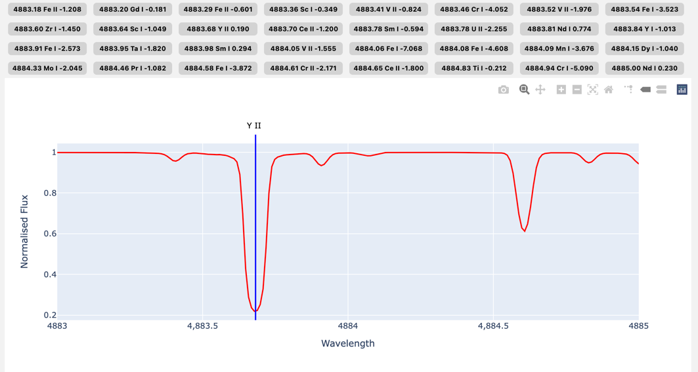

# TSGuiPy 

TSGuiPy is a GUI for [TSFitPy](https://github.com/TSFitPy-developers/TSFitPy) spectral fitting tool. It is a user-friendly interface that allows users to interact with results from TSFitPy, look at the fits, derived abundances, plot synthetic and observed spectra. TSGuiPy provides a graphical interface that allows users to load data and visualize the results of the fitted results. It is designed to be easy to use and accessible to users with varying levels of experience in spectral fitting. TSGuiPy is built using the Flask library and is available as an open-source project on GitHub.

## Installation
 
To install TSGuiPy, you will need to first install the TSFitPy package. You can get TSFitPy from [here](https://github.com/TSFitPy-developers/TSFitPy). Once you have installed TSFitPy, you can install TSGuiPy by cloning this repository INSIDE the TSFitPy directory:

- `cd ./TSFitPy/`
- `git clone https://github.com/stormnick/TSGuiPy.git`

You will need following libraries (on top of TSFitPy dependencies) to run TSGuiPy:

- Flask
- plotly

After that head to `TSGuiPy/src/default_paths.cfg` and set the paths to the Turbospectrum and input files (e.g. linelist, model atmospheres, NLTE files etc.)

## Usage

To run TSGuiPy, you will need to run the following command in the terminal:

- `cd ./TSGuiPy/src/`
- `python app.py`

This will start the Flask server and you can access the GUI by opening a web browser and going to `http://127.0.0.1:5001`

### View spectral fits

To view the spectral fits from the results, you will need to load the fits file that was generated by TSFitPy. You can do this by clicking on the "Choose Files" button and selecting the results folder, then "Upload results folder". Below you can choose your star and "Generate results" to see the fits.

If you have too many files (e.g. many stars), then please zip the results folder and upload the zip file (second option: `Choose file`). TSGuiPy will automatically unzip the file and load the fits.

At the bottom it shows mean abundance and standard error (std / sqrt(number of lines)). You can click on a checkbox next to a line to remove it from the calculation of the mean abundance.

### Abundance diagram

Plots the derived abundances from the fits. You can select whether to include plots that had triggered any ERROR or WARNING flags. You can also add chi2 limits.

### Generate synthetic spectra

You can generate synthetic spectra using the parameters that you type in the form. You can also choose the wavelength range and resolution of the synthetic spectra. 

The spectra also shows location of each line in the synthetic spectra. You can click on the line to plot its central wavelength. `loggf limit blends:` sets the limit for the loggf value of the lines that are displayed in the table.

You can also calculate EW by changing the left and right limits of the line.

If you upload observed spectra, TSGuiPy will plot the synthetic and observed spectra together.

### Plot observed spectra

You can plot the observed spectra that you upload. You can also plot the synthetic spectra that you plot together with it. I.e. you can overplot two spectra.

## Disclaimer

TSGuiPy is still under development and may contain bugs. If you encounter any issues, please report them on the GitHub page. Lots of features are still in development and will be added in the future. E.g. config file, running and monitoring jobs do NOT work yet. M3D@DISPATCH is supported, but since the tool is not public yet, we cannot provide the necessary files to run it.
